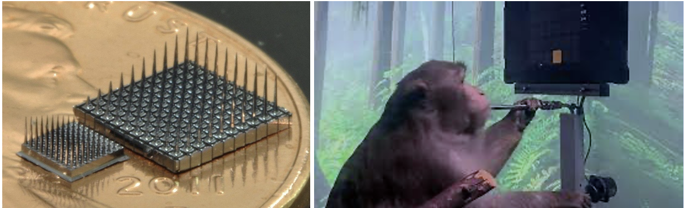
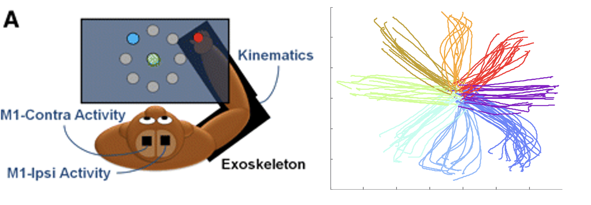

# 2023 BCI decoding lab
Lab written by Karla Montejo for RISE, June 2022. Exercise adapted from 9.40 Introduction to Neural Computation, MIT Spring 2022

In this lab you will use python to: 

*	Open and visualize neural data recorded from macaque motor cortex during a motor behavioral task
*	Complete a code to perform dimensionality reduction to analyze this relatively large dataset of neural recordings and build a rudimentary decoder for neural activity 
*	Challenge: Design an algorithm to control a robotic arm in response to neural activity

Dataset collected in Nicho Hatsopolous’s lab at University of Chicago is contained in the file ReachData.mat. 

## Background – Neuroscience of BCI design
This dataset was collected from the lab of Nicholas G. Hatsopolous, which studies the neural basis of motor control and learning. In other words: using computational methods to model how features of motor behavior are encoded by individual neurons, and how the information is represented in large populations, or “ensembles”, of neurons in motor, premotor, and somatosensory cortex. To do this, research animals like macaques are implanted with small multielectrode arrays in motor areas that can record simultaneously from many neurons. The macaques are trained to carry out motor tasks like playing games or interacting with a motion capture setup and received things like juice as a reward for correct participation. 



_Left: Microelectrode arrays for use in-vivo, shown on a penny. (Photo credit: Richard Norman).
Right: Macaque implanted with a wireless microelectrode array from Neuralink playing pong using a joystick (in his right hand). The tube he is grasping with his left hand delivers his reward, in this case a fruit smoothie. (Photo from Nueralink). When the decoder was trained, the animal could use his thoughts and hand movements alone to play pong without the use of joystick._

## Part 1: Neurons transmit information using a rate (or frequency) code.

Recordings from each individual electrode are filtered to remove artefacts caused by the recording hardware, movements, and other unwanted experimental noise, leaving behind candidate neuronal signals. Each electrode listens in on the population of neurons, rather than just one single neuron per electrode. This kind of data is referred as field potentials. From those aggregate signals, individual spikes are detected using spike sorting algorithms that separate waveforms from individual neurons. (If you’re interested in learning more, some of these algorithms perform dimensionality reduction, which we will be doing in this lab, and clustering). The timing of action potentials can be extracted from the signal, giving a vector of spiking times (t: time) or spiking rates (Hz: amount of spikes / 1 second) that can be matched to the direction of motion the animal was making at that time. 

We will be working with spiking rates from 143 neurons in the motor cortex on both hemispheres over 158 trials. At the start of each trial, the macaque is presented with a visual cue to move its arm from a center starting position, in a certain direction on a circle in front of it, dictated by the direction of the cue, and is rewarded for completing the movement. Each trial contains only one movement of the macaque’s arm, captured with position sensors. There are a total of 8 different reaching directions, each separated from one another by 45 degrees.



_Left: Schematic of the experimental setup for recording of neural activity in both hemispheres of the motor cortex during a center-out reaching task. Think about why it is important to capture both sides of the motor cortex (Ganguly et al. 2009). Right: Paths of the monkey’s arm during each of the 8 different directions represented in our dataset. The axes represent x and y coordinates of the experimental space. Each direction is separated by 45 degrees (Vargas-Irwin et al. 2014)._

Using this data, researchers can build models that explain the encoding of motor activity by neurons in motor cortex. To build a rudimentary decoder, we will use a script to perform dimensionality reduction using principal component analysis (PCA). In our original dataset we have 143 neurons, therefore conceptually our data lies in 143-dimensional space. Our goal is to find some number of features that explain the most variance in this high dimensional data. Those features may not be the activities of single neurons, but rather represent weighted sums of certain neuronal populations that were most correlated with the task. If we can isolate two or three of these features from the data  space, we can project (or transform) the high dimensional data and re-visualize the data in a space that’s more manageable and meaningful. 

Let’s open a new python file called “bci.py” and load our macaque recording data. 

You will need to start your code by importing the following packages:

```python
import numpy as np
import numpy.matlib as npm
import matplotlib.pyplot as plt
import copy
from scipy.io import loadmat
import numpy.linalg as npl
```

Now let’s open the file. First, make sure the data file has been added to your directory, in this case, on your machine or on the cs50 platform. Make sure that it is either in the same folder as your code file, or that you specifiy a path to the folder it it is contained in when you use the function to load. The data is contained as a matlab formatted datafile, or “mat” file. Also open the contents of the file and take a look at the format. This will help us understand how to slice our data. 

```python
#loading data from mat file
Data = loadmat("ReachData.mat")

# take a second to look at the data you just uploaded. What kind of format is it in? How is the data stored?
Data
```

Notice that the data is sotred into two arrays named 'direction' and 'R'. Use the ‘shape’ method to see the size of data arrays. 

The matrix R contains the firing rate of each of 143 neurons for a total of 158 trials. 
The vector direction specifies the reach direction for each of the 158 trials. The direction is encoded for simplicity as a single number representing the angle the animal was asked to move its arm in. Direction 1 corresponds to a rightward reach (0 degrees), direction 2 to 45 degrees, direction 3 to 90 degrees (straight up), etc, with direction 8 corresponding to 315 degrees. 

Practice using 'shape' and slicing by assigning the size of each dimension in R to a variable. You can try calling those variables "num_neruons" for number of neurons for example, and "num_trials" for number of trials. 

You may also want to extract the data from the mat file into an array to make working with it easier. Make sure the size of the data checks out. You can use print statements and "shape".

```python
direction = # slicing out direction data
rate = # slicing out neural data, contains firing rate of 143 neurons for a total of 158 trials

# each trial has a corresponding direction stored in the "direction" list which should have 158 entries
# for each trial, the average firing rate of each of the 143 neurons is recorded 
```

## Part 2: Decoding neural activity during the reaching task

In this part of the lab we will apply an analysis technique called dimensionality reduction. If you would like the challenge of trying to implement this in your own style, please feel free to import additional libraries and follow your own path. Here is a link that should get you started. 

[PCA guide by Zakaria Jaadi](https://builtin.com/data-science/step-step-explanation-principal-component-analysis#)

If you are more interested in the neural decoding portion of this lab and would prefer a more 'on rails' PCA learning experience, follow along with the lab and use the "Reveal Code" dropdowns for template code. 

We are going to apply principal component analysis (PCA).

We first center the data by removing the population mean from each point, thereby centering our data cloud around 0. To do this, we will use a function called "repmat" which will create a matrix the same size as the data we are subtracting it from. If they were not the same size, it would take more steps to do the subtraction. We also have to check if we need to transpose the data to perform the subtraction. Because the highest dimension we can visualize is 3-dimensional space, it’s not straightforward to imagine how our data cloud appears in its high dimensional space, but take our word for it, now its centered. 

<details>
<summary>Reveal Code</summary>
<pre>
  # first we find the mean using the method ".mean" from numpy which we have imported as "np" to make it easier to call (less typing each time)
mean = np.mean(rate,axis=1) # 143 dimensional horizontal vector, one mean for each neuron
# then we make an array the same shape as our data of this mean (mean of each neuron repeated for all trials)
mean_vector = npm.repmat(mean, trials,1).T # repeat mean 158 times and take transpose using ".repmat" and ".T" from numpy.matlib
# then we substract the mean from each neuron
# Z will be our centered data variable
Z = # write code to substract the mean from each measurement in each trial, Hint: check array sizes match
</pre>
</details>

Print out the shapes of "mean", "mean_vector", and "z". Do these sizes check out with what we expect?

At this point we can optionally try seeing what correlations we can come up with, and whether they are any useful at this stage, using the centered neuron firing data. You can feel free to play around with the data in your own way, or you can follow along with the lab suggestion. 

<details>
<summary>Reveal Suggestion</summary>
<pre>
# We can try to visualize the neuronal data along any arbitrary two dimensions to observe how the population of neurons in motor cortex fires differently when the monkey reaches in different directions. First, write Python code to plot two dimensions (e.g., Neurons 7 and 8) of the centered data. 
<br>
# we can do this by looping through the data and plotting each reaching direction in a different color.
# lets recall how the directions are labeled in the data
print(direction.shape)
<br>
# To make looping through directions easier, we can remove the extra dimension in our direction array using "squeeze"
dir = np.squeeze(direction)
print("dir.shape :",dir.shape)
<br>
# Now write code to plot the color coded neural acitivty. neuron 7 firing rate should be on one axis and neuron 8 should be on the other
# each reaching direction should be coded by a different color
# directions range from 1 to 8 corresponding to 0 through 315 degrees in 45 degree angles
<br>
for #insert your loop here : 
   # find index of data that matches direction iterating in loop
   # plot neuron 7 and 8 data for that index
   # go on to next direction
</pre>
</details>

**Does any pattern stand out to you? What can we say about how the reaching motion is encoded in the firing rates at this point in our analysis?**

The second step after centering our data is to compare the firing rates for each neuron with one another across trials to get a sense of how their activities co-vary with one other when the animal is moving in a single direction. This is done by computing a covariance matrix. This is a 143 by 143 square matrix where each entry of the matrix is the value of the covariance of a neuron with another partner in the dataset. Positive values indicate positive correlation, meaning as one neuronal firing rate increases, so does the other partner neuron. Negative values indicate the opposite correlation between firing rates, as one increases firing, the other neuron will decrease firing. 

To compute the covariance matrix **Q**, multiply the centered data matrix you obtained above by its transpose and divide by the number of trials using the variable ‘trials’. 

<details>
<summary>Reveal Covariance Code</summary>
<pre>
# Compute the covariance matrix that we will use to determine the principal neuronal components. 
# What size is this matrix? What does the ijth entry of this matrix represent?
<br>
Q = (Z@Z.T)/trials #this is our covariance matrix
</pre>
</details>

**Examine a few elements of this matrix. What do you expect the diagonal of this matrix to represent?**

The covariance matrix is what we will use to find the principle neuronal components that explain most of the variance in the data cloud. We do this by computing the eigenvectors of the covariance matrix, which are directions of maximal variance in the data. There is one eigenvector for every dimension in the original dataset, which means we will have 143 eigenvectors. Each vector V comes paired with a value, called its eigen value D, proportional to how much variance is captured by that eigenvector. To find the 2 directions of maximal variance, we will choose the two highest eigenvalues and their corresponding eigenvectors will serve as those principal directions.

<details>
<summary>Reveal Eigenvector Code</summary>
<pre>
# Use the eig command from numpy.linalg toolbox to compute the eigenvectors and eigenvalues 
# of the covariance matrix. 
(D,V) = npl.eig(Q)
<br>
print(D) # notice the values are in decreasing order
print("*****************************")
print(V) # these are the vectors corresponding to those values
</pre>
</details>

Sort the eigenvalues from high to low using the method ‘.argsort’. Hint: because of the python method we used to get eigenvalues, the order happens to be the same. This is because the output is already automatically sorted. But its good practice to always sort just in case you use a different method. 

<details>
<summary>Reveal Code</summary>
<pre>
# When using other toolboxes, in general they are not correctly ordered. 
# Its a good idea to always order the vectors and values just in case
<br>
# get the indeces corresponding to the reordering of the eigenvalues
indx = D.argsort()[::-1]
<br>
# sort the eigenvectors according to those indeces
D1 = D[indx]    # order happens to be the same as in D
V1 = V[:,indx]
</pre>
</details>

Try printing the indx variable and check that they are in order.

Next, we want to know how much of the variance each eigenvalue captures. This is for us to know how much we are describing with each additional PC dimension we consider. To do this we look at the cumulative sum of each value. **We have done this part for you, but we leave the plotting part to you!**

<details>
<summary>Reveal Code</summary>
<pre>
# Now we will plot the eigenvalues and the percent of the variance they explain in decending order.
# To do this we will call the cumulative sum function from numpy [np.cumsum()]              
<br>
var_explained = np.cumsum(D1)/sum(D1) 
<br>
# write your code for the plotting "var_explained" here! Use correct x and y axis labels
<br>
# What is the percent variance explained by first two principal components?
print("Variance explained by first two PCs : ",format(var_explained[1],'.2%'))
</pre>
</details>

Since we know we can capture a high amount of our original data’s variance in just the first two eigenvalues, let’s use these to re-visualize our data and try to make sense of the results. Now we are going to project (transform) the centered data onto the first two eigenvectors, which correspond to those eigenvalues. In python, projections are carried out by straightforward matrix multiplications using the **(@)** operator. 

<details>
<summary>Reveal Code</summary>
<pre>
# Now that we have seen what the data loks like for two neurons (two dimensions of the original data space)
# we will see what our data looks like using the principal components from our analysis. 
# Plot the data using the first two principal components
<br>
# to do this we have to rotate the data using the eigenvectors of our covariance matrix 
#in short, these are teh directions which expain maximal variance in our data (directions) the resulting dimensions are no longer single neurons, 
# in the rotated data dimensions are the sums of multiple neurons in such a way that separates our data the most
<br>
# project the data using matrix multiplication
Zproj = V1.T[:2,:]@Z
# Zproj = V1.T@Z # uncomment this to have access to all PCs later
</pre>
</details>

**Pause: What is the resulting size of your newly transformed data?** This transformation has rotated the original data such that each point lies in a reduced-dimensional space along the two principal components. Like what we did before performing PCA on the data, plot the first two principal components of your projected data directions using a different color for each reaching direction. 

```python
# repeat the same plotting process but for the first two principal components of the data
# plot the color coded neural acitivty using the first two principal components of the data (Zproj)

# directions range from 1 to 8 corresponding to 0 through 315 degrees in 45 degree angles
for #insert your loop here : 
   # find index of data that matches direction iterating in loop
   # plot first and second dimension of Zproj
   # go on to next direction
```

<details>
<summary>If really stuc, reveal answer</summary>
<pre>
print(V1[:2,:].T.shape)
print(Zproj.shape)
<br>
# repeat the same plotting process but for the first two principal components of the data
fig3, ax3 = plt.subplots(figsize=(8,8))
<br>
for idx in range(np.max(direction)):
  ind = np.argwhere(direction==idx+1)
  ax3.plot(Zproj[0,ind][:,0], Zproj[1,ind][:,0], '.', markersize=15, label=str(idx*45))
<br>  
fig3.legend()
ax3.set(xlabel='PC 1', ylabel='PC 2')
ax3.grid()
<br>
# now the data is well separated and directions have been decoded
</pre>
</details>

**Do any patterns stand out to you now? What does this tell us about the task coding in the cortex? Compare this plot with the image in figure 2, what have we been able to recover (decode) from the neural data?**

**Challenge question: Can you describe what the principal components represent in terms of the data? Think about each step in performing PCA and the resulting transformation.**

# Part 3: Challenge – Programming a BCI, moving a prosthetic arm.


